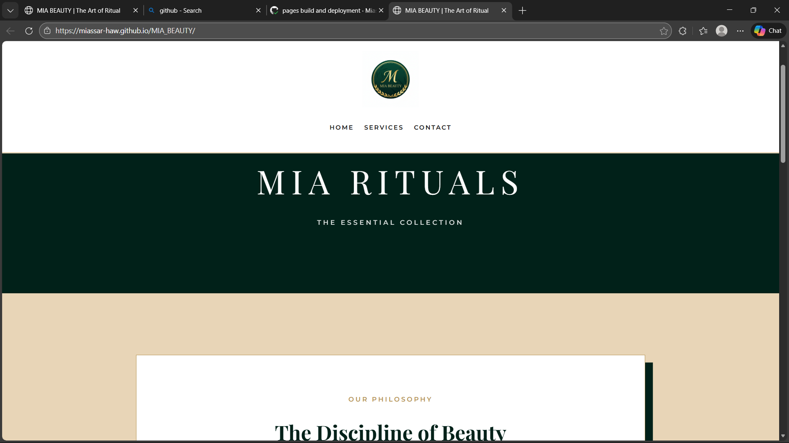

# MIA BEAUTY | Luxury Skincare Rituals

## Project Overview

This project is a static e-commerce website created using HTML and CSS for MIA BEAUTY. It demonstrates a high-end "Modern Editorial" aesthetic with a focus on clean page structure, intuitive navigation, and responsive design. The site is fully W3C validated with zero errors and contains no JavaScript.

## Website Pages
**Home page:** Introduction to the brand and the Essential Collection.
**Services page:** Detailed catalog of Advanced Facial and Eye Rituals.
 **Contact page:** Boutique location, Google Maps integration, and Inquiry Form.

## Technologies Used
HTML5 (Semantic Structure)
CSS3 (Responsive Design & Grid)
GitHub Pages (Deployment)

## live Website
https://Miassar-haw.github.io/project-Miassar/

## Screenshots

## Author
Miassar – CST0400 – 2025/26 